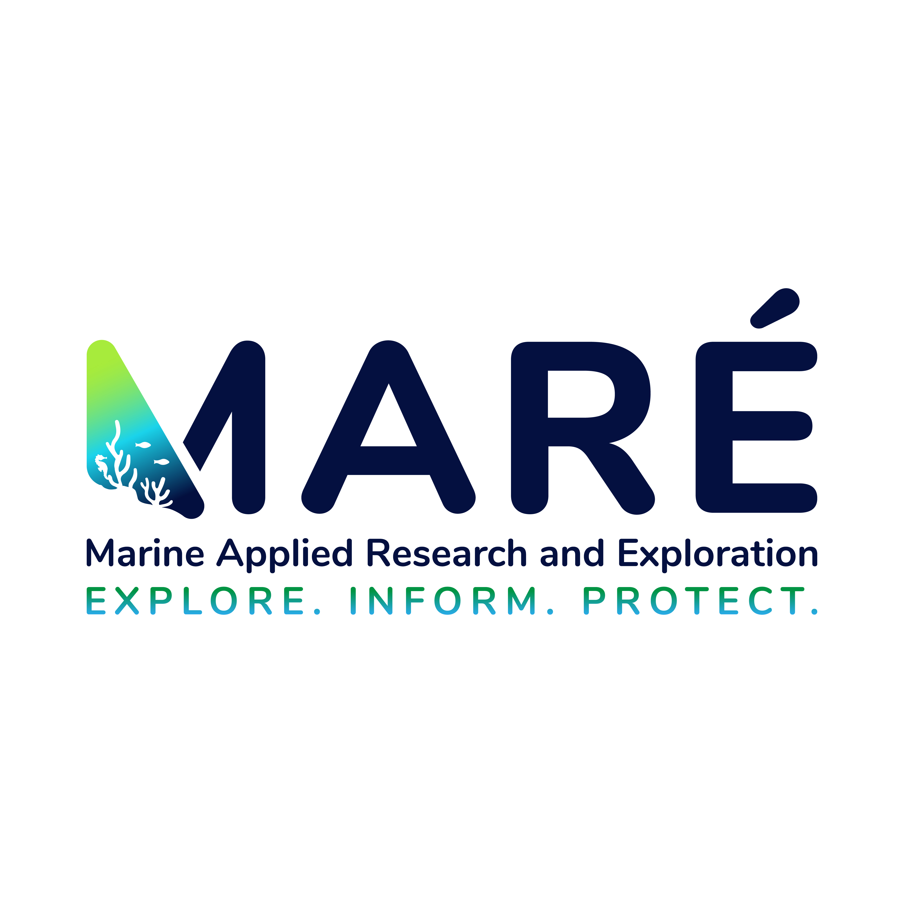

<p align="center">
  
</p>

<p align="center">
  <strong>Explore. Inform. Protect.</strong>
</p>

# Marine Applied Research & Exploration

**Marine Applied Research & Exploration — MARÉ —** is a nonprofit marine science and technology organization that develops and operates systems for exploring, documenting, and understanding ocean ecosystems.

We combine marine robotics, offshore field operations, biological expertise, software engineering, and data analysis to produce reliable information for researchers, resource managers, government agencies, and conservation partners.

## What We Do

- Design and operate remotely operated vehicles and specialized subsea systems
- Conduct visual surveys of deep-water marine habitats
- Collect biological, environmental, spatial, imagery, and video data
- Transform expedition data into structured scientific observations
- Build software for marine operations, video review, data processing, and reporting
- Develop computer-vision and machine-learning tools that support expert analysis
- Apply marine technology to habitat assessment, restoration, and resource management

## Our Work

MARÉ develops integrated systems covering the full marine-data lifecycle:

```text
Expedition Planning
        ↓
Robotic Data Collection
        ↓
Video, Sensor, and Spatial Data
        ↓
Expert Review and Analysis
        ↓
Scientific Data Products
        ↓
Marine Management and Conservation
```

Our engineering and research work includes:

- Remotely operated vehicles
- Subsea cameras, sensors, and instrumentation
- Navigation, telemetry, and vehicle-control systems
- Underwater video and imagery infrastructure
- Marine databases and application programming interfaces
- Computer-vision and machine-learning workflows
- Video annotation and expert-review applications
- Automated data processing and report generation

## Why We Build

Much of the ocean below scuba depth remains difficult and expensive to observe. MARÉ builds practical systems that put eyes on the seafloor, expand access to marine information, and support informed decisions about ocean ecosystems.

> Technology should extend the reach of marine experts—not replace their judgment.

## Our GitHub Organization

This GitHub organization contains software, documentation, research resources, and technical tools developed in support of MARÉ's marine operations and scientific workflows.

Individual repositories may include:

- Marine data-processing utilities
- Video and imagery analysis tools
- Machine-learning research
- Robotic vehicle software
- Expedition-support systems
- Public datasets and benchmarks
- Reproducible scientific workflows

Each repository documents its intended use, maturity, dependencies, and licensing terms.

## Learn More

Visit **[maregroup.org](https://maregroup.org)** to learn more about our expeditions, technology, research, and partnerships.

---

<p align="center">
  <strong>Marine Applied Research & Exploration</strong><br>
  Exploring ocean ecosystems beyond human reach.
</p>
